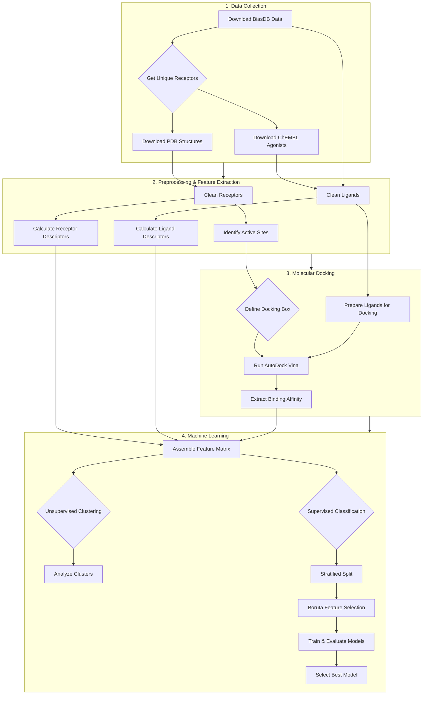
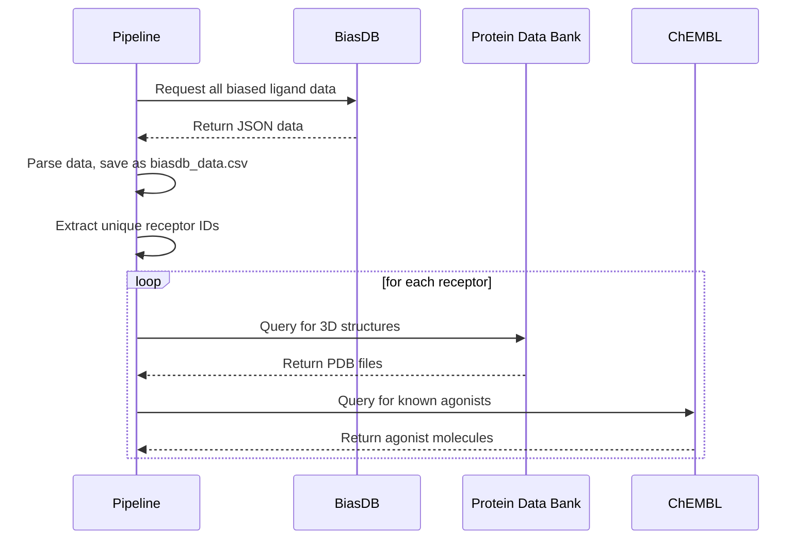
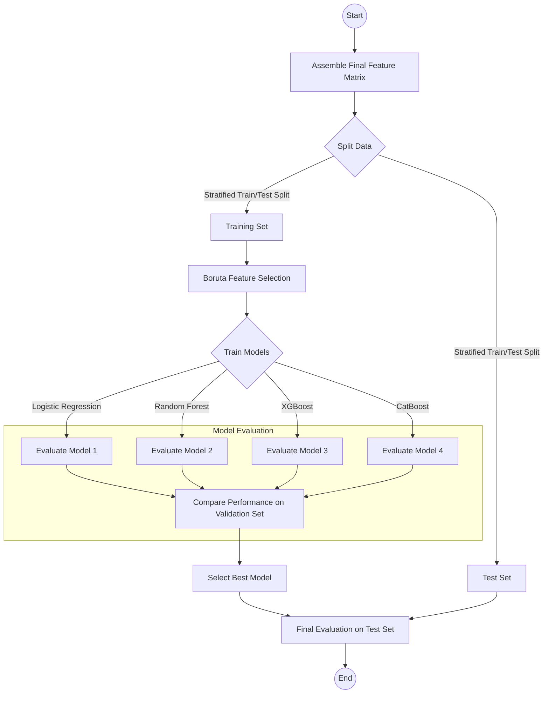

# CancerAg: A Reproducible Pipeline for Biased Agonist Identification

[](https://www.python.org/)
[](https://opensource.org/licenses/MIT)

CancerAg is a computational framework designed to identify and predict biased agonism in G-protein-coupled receptors (GPCRs). This project provides a fully reproducible pipeline that automates data collection, molecular docking, feature engineering, and machine learning to classify ligands based on their signaling pathways.

## ✨ Features

-   **Automated Data Collection:** Gathers data from BiasDB, PDB, and ChEMBL to build a comprehensive dataset.
-   **Dynamic Active Site Identification:** Uses co-crystallized ligands to accurately define docking sites, avoiding generic coordinates.
-   **Robust Feature Engineering:** Calculates over 200 molecular descriptors for ligands and characterizes receptor binding pockets.
-   **Integrated Molecular Docking:** Utilizes AutoDock Vina to predict ligand binding affinities.
-   **Hybrid Machine Learning Approach:** Employs both unsupervised clustering to discover natural data separations and supervised learning for predictive classification.
-   **Advanced Model Training:** Implements powerful feature selection with Boruta and trains multiple state-of-the-art models (XGBoost, CatBoost, RandomForest).
-   **Reproducibility:** The entire pipeline is configurable and scriptable, ensuring consistent results.

## 🏗️ Pipeline Architecture

The project is organized into four main stages, flowing from raw data collection to final model evaluation.



##  workflows

### Data Collection Workflow

This sequence diagram illustrates how the pipeline gathers data from external databases.



### Machine Learning Workflow

This diagram shows the steps involved in the machine learning phase, from feature assembly to model deployment.



## 🚀 Getting Started

### Prerequisites

-   Python 3.10+
-   [UV](https://github.com/astral-sh/uv) package manager
-   [AutoDock Vina](http://vina.scripps.edu/download.html)

### Installation

1.  **Clone the repository:**
    ```bash
    git clone https://github.com/your-username/cancerag.git
    cd cancerag
    ```

2.  **Install Python dependencies using UV:**
    ```bash
    uv pip install -r requirements.txt
    ```

3.  **Install AutoDock Vina:**
    Follow the instructions on the [official website](http://vina.scripps.edu/download.html) to install Vina and ensure it is available in your system's PATH.

### Configuration

All pipeline parameters are controlled from the `configs/config.yaml` file. Before running, you can adjust settings such as file paths, docking exhaustiveness, and machine learning model parameters.

### Usage

To run the entire pipeline, execute the main script:

```bash
python src/cancerag/main.py
```

## 📁 Project Structure

```
.
├── configs/
│   └── config.yaml         # Pipeline configuration
├── data/
│   ├── raw/                # Raw downloaded data (BiasDB, ChEMBL)
│   ├── interim/            # Intermediate data files
│   ├── processed/          # Final processed data for ML
│   └── pdb/                # Downloaded PDB files
├── results/
│   ├── figures/            # Plots and visualizations
│   ├── models/             # Saved trained models
│   └── reports/            # Generated reports
├── src/
│   └── cancerag/
│       ├── data_collection/ # Scripts for downloading data
│       ├── preprocessing/   # Data cleaning and preparation scripts
│       ├── features/        # Feature extraction scripts
│       ├── docking/         # Docking-related scripts
│       ├── ml/              # Machine learning models and training
│       └── main.py          # Main pipeline execution script
├── tests/                  # Unit and integration tests
├── pyproject.toml          # Project metadata and dependencies
└── README.md               # This file
```

## 🤝 Contributing

Contributions are welcome! Please feel free to submit a pull request or open an issue.

## 📄 License

This project is licensed under the MIT License. See the [LICENSE](LICENSE) file for details.
