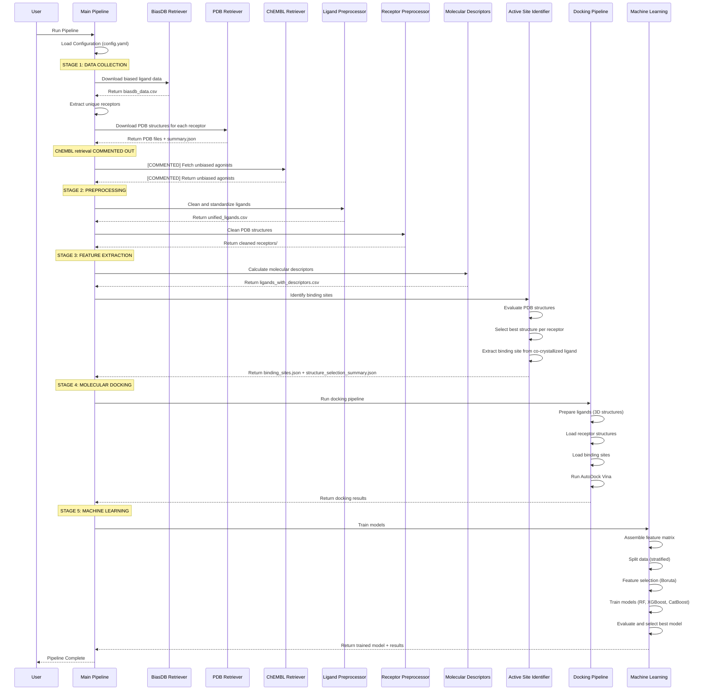
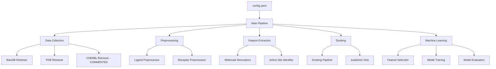
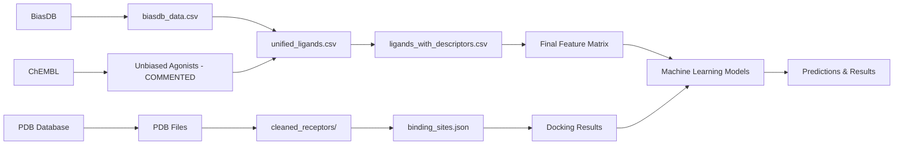

# CancerAg Pipeline Sequence Diagram

## Complete Pipeline Flow



## Configuration Flow



## Data Flow



## Key Components Interaction

### 1. Configuration Management

- **config.yaml**: Central configuration file
- **Paths**: All file paths defined in config
- **Parameters**: Docking, ML, and processing parameters

### 2. Data Collection

- **BiasDB Retriever**: Downloads biased ligand data
- **PDB Retriever**: Downloads receptor structures
- **ChEMBL Retriever**: [COMMENTED] Downloads unbiased agonists

### 3. Preprocessing

- **Ligand Preprocessor**: Standardizes SMILES, removes duplicates
- **Receptor Preprocessor**: Cleans PDB files, removes water/ligands

### 4. Feature Extraction

- **Molecular Descriptors**: Calculates ~200 RDKit descriptors
- **Active Site Identifier**: Selects best structure, identifies binding sites

### 5. Docking

- **Docking Pipeline**: Prepares ligands and receptors
- **AutoDock Vina**: Performs molecular docking
- **Results**: Binding affinity scores

### 6. Machine Learning

- **Feature Assembly**: Combines descriptors + docking scores
- **Model Training**: Multiple algorithms (RF, XGBoost, CatBoost)
- **Evaluation**: Cross-validation and test set evaluation

## File Dependencies

```text
config.yaml
├── data/raw/
│   ├── biasdb_data.csv
│   └── chembl/ (COMMENTED)
├── data/pdb/
│   ├── summary.json
│   └── [receptor_dirs]/
├── data/processed/
│   ├── unified_ligands.csv
│   ├── receptors/
│   ├── ligands_with_descriptors.csv
│   ├── binding_sites.json
│   └── structure_selection_summary.json
└── results/
    ├── docking_results/
    ├── models/
    └── reports/
```

## Current Status

✅ **Completed:**

- BiasDB data collection
- PDB structure retrieval
- Ligand preprocessing
- Receptor preprocessing
- Molecular descriptor calculation
- Enhanced active site identification
- Receptor-ligand mapping

🔄 **In Progress:**

- Molecular docking pipeline
- Machine learning implementation

📝 **Planned:**

- Unbiased agonist addition (when needed)
- Model evaluation and selection
- Results visualization
